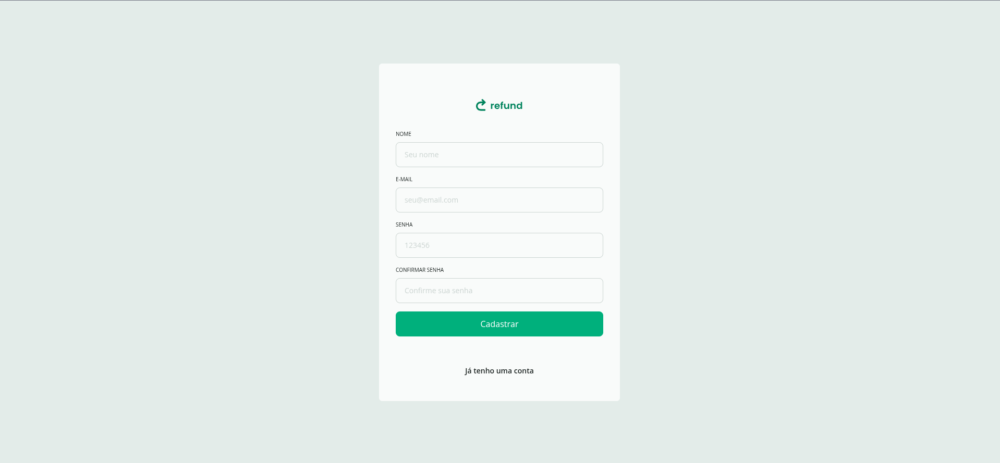
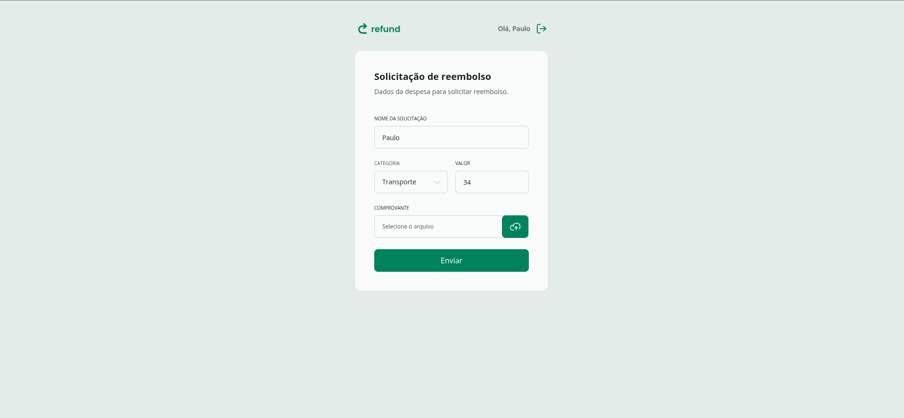
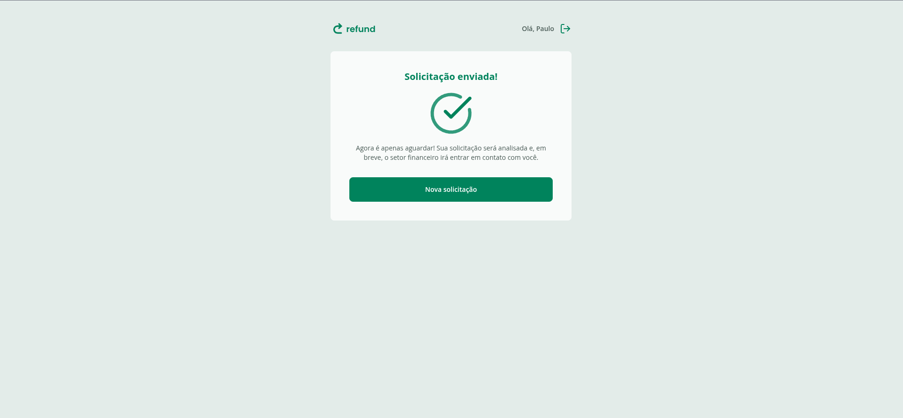
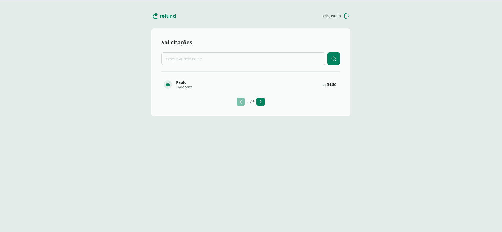
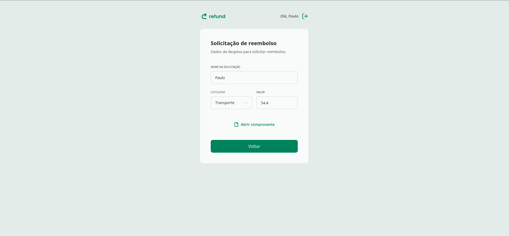

<h1 align="center">

</h1>

<p align="center">Aplicação web para gestão de solicitações de reembolso com perfis de usuário e administrador</p>

<div align="center">
    
    
    
    
    
    
</div>

<h2 id="project">📁 Projeto</h2>

<p>
  Sistema completo para gestão de solicitações de reembolso onde:
</p>

- **Usuários** podem:
  - Criar novas solicitações
  - Upload de comprovantes (PDF/Imagens)

- **Administradores** podem:
  - Visão geral de todas as solicitações
  - Filtros e busca avançada
  - Visualização de comprovantes anexados

<h2 id="technologies">💻 Tecnologias & Ferramentas</h2>

<div align="center">
  
  
  
  
</div>


### Principais Bibliotecas:
  - `clsx` & `tailwind-merge` para gestão de classes


## ⚙️ Instalação

1. Clone o repositório
```bash
git clone https://github.com/pcaldi/refund.git
```
2. Instale as dependências
```
npm install
```

3. Rode o projeto
```
npm run dev
```


## 👨🏻‍💻 Autor

<a href="https://github.com/pcaldi">
 
 <br />
 <sub><b>Paulo Caldi</b></sub></a> <a href="https://github.com/pcaldi" title="emoji">🙋🏻</a>
 <br />

[](https://www.linkedin.com/in/pcaldi/)
[](mailto:pcaldi@gmail.com)


---
